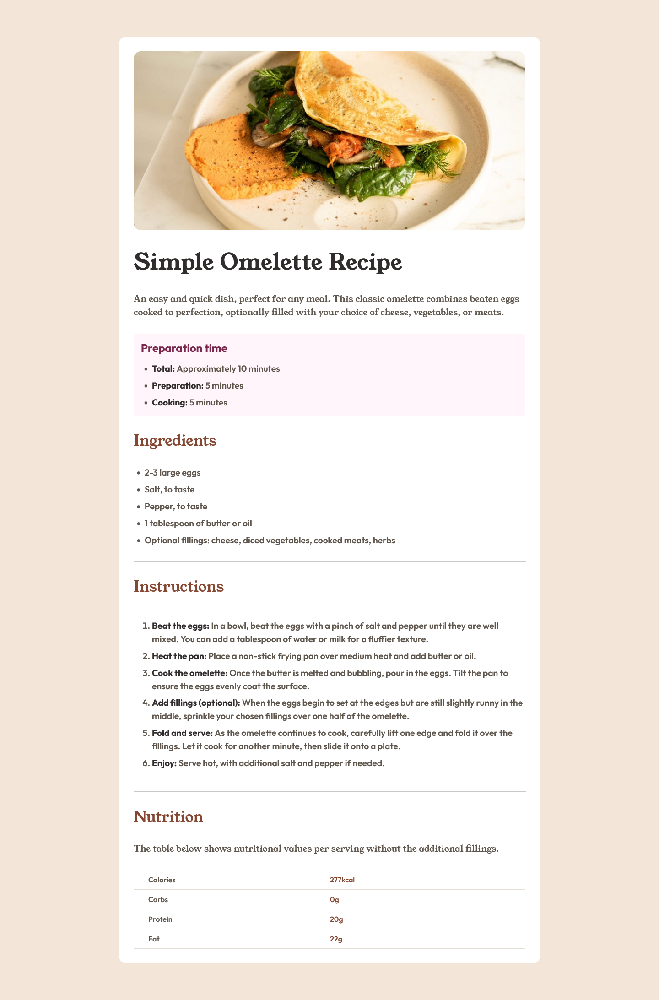
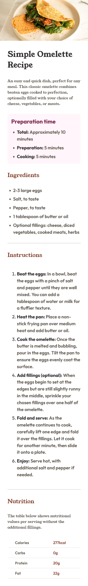

# Frontend Mentor - Recipe page solution

This is a solution to the [Recipe page challenge on Frontend Mentor](https://www.frontendmentor.io/challenges/recipe-page-KiTsR8QQKm). Frontend Mentor challenges help you improve your coding skills by building realistic projects.

## Table of contents

- [Overview](#overview)
  - [The challenge](#the-challenge)
  - [Screenshot](#screenshot)
  - [Links](#links)
- [My process](#my-process)
  - [Built with](#built-with)
  - [Continued development](#continued-development)
  - [Useful resources](#useful-resources)
- [Author](#author)
- [Acknowledgments](#acknowledgments)

**Note: Delete this note and update the table of contents based on what sections you keep.**

## Overview

This challenge is to create a recipe page following the provided design. To achieve it I used just html and css.

### The challenge

### Screenshot

### Links

- Solution URL: [Add solution URL here](https://github.com/will-lucena/frontendmentor-recipe-page)
- Live Site URL: [Add live site URL here](https://will-lucena.github.io/frontendmentor-recipe-page/)

## My process

I followed a mobile-first workflow, so first I understood the areas in the mobile layout, break it into components and then started adding the html tags. Once I've finished this markup process I started the styling, creating a css file and doing the components I've visualized before styles.

After finish the mobile version, I splited the files into mobile.css and desktop.css, using media query to add the desktop layout with it's adjustments.

### Built with

- Semantic HTML5 markup
- CSS custom properties
- Flexbox
- Media queries
- Mobile-first workflow

### Continued development

I started doing it because of an website for recipes ideia, so I'll use this layout and code as base to the recipe page that will be acessed by a direct url or recipes list page, loading data from a with api. The full website will include recipes list, user's profile, login, a generate image from html feature to share and etc

## Author

- Website - [Will Lucena](https://will-lucena.vercel.app/)
- Frontend Mentor - [@will-lucena](https://www.frontendmentor.io/profile/will-lucena)
